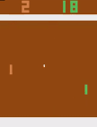

# Deep Reinforcement Learning Baselines with CNTK

🔴 Incomplete. Checkout Progress Below 🔴

## Progress Tracker 
(4 week plan)
### Week 1/4
| Algorithm   | Implementation | Pre-Trained Policies | Demo             |
| ----------- | -------------- | -------------------- |------------------|
| Simple DQN  | ✔️             | ❌                  |                 |
| DQN         | ❌             | ❌                  |                  |
| Double DQN  | ❌             | ❌                  |                  |
| REINFORCE   | ✔️             | ✔️                  |  |
| A2C         | ✔️             | ❌                  |                  |
| A3C         | ❌             | ❌                  |                  |
| PPO         | ❌             | ❌                  |                  |
| DDPG        | ❌             | ❌                  |                  |
| SAC         | ❌             | ❌                  |                  |
| TRPO        | ❌             | ❌                  |                  |
| HER         | ❌             | ❌                  |                  |
| GAIL        | ❌             | ❌                  |                  |

This repository is meant to teach the intricacies of writing advanced Deep Reinforcement Algorithms in CTNK. A lot of good repositories for RL exists but use Tensorflow/PyTorch. Most of them are easy to USE libraries rather than easy to UNDERSTAND libraries. There is a steep learning curve for someone new to the field who wants to modify existing architectures or explore possibilities.

The code in this repository is heavily commented and the comments serve as a guide to read through the entire library and learn reinforcement learning as well as CNTK API. On flip side, this may not be a production grade library although it achieves state of the art results on Atari environments.

The code is used as a guide, in weekly Deep Learning meetings at Ohio State University, for teaching -

1. How to read an RL paper
2. How to implement it in CNTK (or library of your choice)

I choose CNTK because -
1. I joined Microsoft recently
2. Lack of tutorials/comprehensive documentation in CNTK

Reinforcement learning architectures contain more complexities then standard DNNs. Each paper has its own implementation quirks and therefore understanding code of existing algorithms clearly lets you write/discover novel architectures.

## Environment Setup for Source Code
All of the code is tested with CPU version of CNTK. I use Ubuntu 16.04 or Windows 10 on Azure. Mac OS have additional complications during setup. Following steps show setup for Ubuntu 16.04 -

1. Ubuntu 16.04 comes pre-installed with python 3.5. So install pip using  
``` python3 get-pip.py --user```  
2. Use pip to install virtualenv to sandbox your python installations  
```python3 -m pip install virtualenv --user```  

3. Create a new environment with virtualenv and activate it  
```virtualenv -p /usr/bin/python3 env```  
```source env/bin/activate```  
4. Install OpenAI gym with Atari dependencies  
```pip install gym[atari]```  
5. Install CNTK with pip. But before that, CNTK requires openmpi  
```sudo apt update```  
```sudo apt-get install openmpi-bin```  
```pip install cntk```  
6. Video recording of gym environments requires FFMPEG. Also install OpenGL  
```sudo apt install ffmpeg```  
7. (Optional) Install tmux since typical training will go on for days  
```sudo apt install tmux```  
8. (Optional) I also record videos on Azure VMs so I require a virtual display to capture frame renderings  
```sudo apt-get install python-opengl```  
```sudo apt-get install xvfb```  
```pip install pyvirtualdisplay```  
